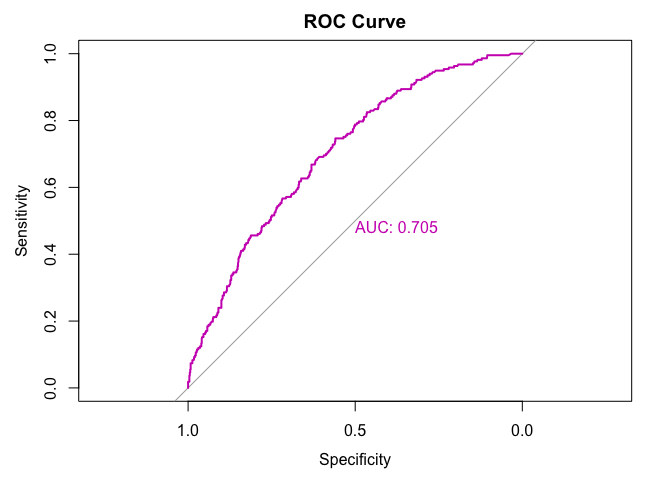
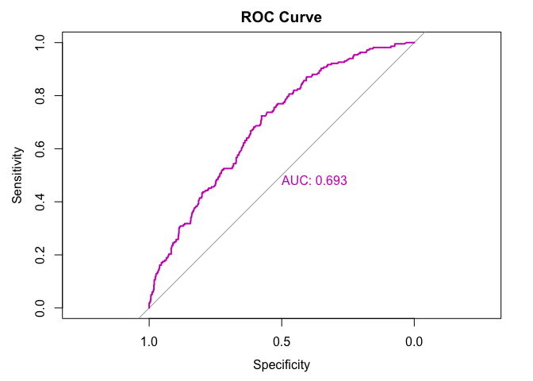
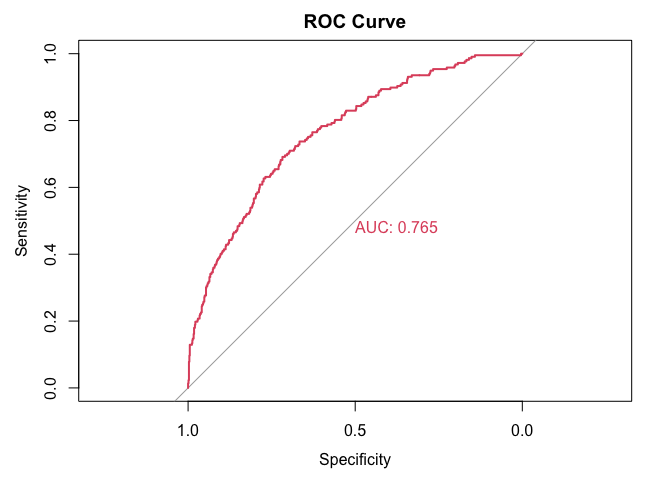
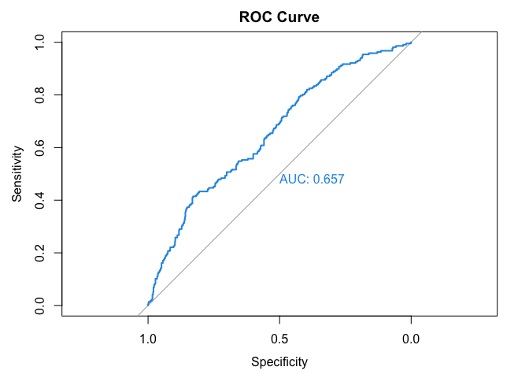

<p style="display:inline-block;">
  
  <h1>missALI: Overcoming missing data to predict hospitalization from the ALI</h1>
</p>

## Installation

Installation of the `missALI` package from GitHub requires the
[`devtools`](https://www.r-project.org/nosvn/pandoc/devtools.html)
package and can be done in the following way.

``` r
# Install the package (run once) 
devtools::install_github(repo = "sarahlotspeich/missALI")
```

``` r
# Load the package (run every time you want to use it) 
library(missALI)
```

## Functionality

Using the dataset `hosp_dat` for illustration, the `missALI` package
contains functions to fit prediction models with…

- **Two types of outcome:** binary (logistic regression) or count
  (Poisson regression),
- **Two types of ALI components:** binary (healthy/unhealthy) or
  numeric, and
- **Five approaches to handle missing components:** missingness
  indicators (only for binary ALI components),

Example code for each of these options follows.

## Modeling Different Types of Outcomes

### Binary Outcomes

Our binary outcome is called `ANY_ADMIT` and can be summarized by the
following count frequency table.

``` r
# Binary outcome: Any hospitalization (yes/no)
table(hosp_dat$ANY_ADMIT)
```

    ## 
    ##   0   1 
    ## 783 217

In the `missALI` package, there are functions for the various missing
data approaches. Each of these functions can handle *either* a binary or
count outcome. The user simply specifies which type of model they want
through the `family` argument, as they would with the built-in `glm()`
function in R.

For a binary outcome, we let `family = "binomial"` in all of the
situations that follow.

### Count Outcomes

Our binary outcome is called `NUM_ADMIT` and can be summarized by the
following count frequency table.

``` r
# Count outcome: Number of hospitalizations (0, 1, 2,...)
table(hosp_dat$NUM_ADMIT)
```

    ## 
    ##   0   1   2   3   4   5   6   7   8   9  12  13  14 
    ## 783 132  42  18  12   3   1   1   3   2   1   1   1

In the `missALI` package, there are functions for the various missing
data approaches. Each of these functions can handle *either* a binary or
count outcome. The user simply specifies which type of model they want
through the `family` argument, as they would with the built-in `glm()`
function in R.

For a count outcome, we let `family = "poisson"` in all of the
situations that follow.

## Using Different Missing Data Approaches

Each of the following missing data approaches is demonstrated for the
binary outcome, but can be applied with count outcomes instead by
replacing the `outcome` and `family` arguments as outlined above.

Most of the missing data approaches are specifically for when we use the
**binary** versions of the ALI components, rather than the numeric ones.
However, imputation can also be done on the original **numeric**
measurements from which the ALI components were derived.

### Missingness Indicators

For each of the 10 ALI components, we can go from two levels
(unhealthy/healthy) to three levels (unhealthy/healthy/missing). Then,
we fit the model using a 3-level categorical variable for each
component, further controlling for age and sex.

``` r
# Allow each ALI component to be either healthy, unhealthy, or missing 
## and fit a model with each component separately as predictors (+ other covariates)
mod_log_ind = miss_ind_approach(outcome = "ANY_ADMIT", 
                                covar = c("SEX", "AGE_AT_ENCOUNTER"), 
                                data = hosp_dat, 
                                family = "binomial") 

# View the fitted model coefficients
mod_log_ind$fit |> 
  coefficients()
```

    ##             (Intercept)          A1C_FUnhealthy            A1C_FMissing 
    ##           -15.873789092             0.382855076            -0.183276712 
    ##          ALB_FUnhealthy            ALB_FMissing          BMI_FUnhealthy 
    ##            -0.858847380            -2.744298395             0.429215274 
    ##            BMI_FMissing         CHOL_FUnhealthy           CHOL_FMissing 
    ##           -12.408278876            -0.108450557             1.246828153 
    ##          CRP_FUnhealthy            CRP_FMissing      CREAT_C_FUnhealthy 
    ##             0.402441396            -0.809959596            30.888433717 
    ##        CREAT_C_FMissing           HCST_FMissing         TRIG_FUnhealthy 
    ##            14.790745470            -0.273152588             0.208069585 
    ##           TRIG_FMissing BP_DIASTOLIC_FUnhealthy  BP_SYSTOLIC_FUnhealthy 
    ##                      NA            -0.150939481             0.105122329 
    ##                 SEXMale        AGE_AT_ENCOUNTER 
    ##            -0.007033514             0.029290626

``` r
# View the fitted model summary
mod_log_ind$fit |> 
  summary()
```

    ## 
    ## Call:
    ## glm(formula = as.formula(paste(outcome, "~", paste(c(factor_ALI_comp, 
    ##     covar), collapse = "+"))), family = family, data = data)
    ## 
    ## Coefficients: (1 not defined because of singularities)
    ##                           Estimate Std. Error z value Pr(>|z|)    
    ## (Intercept)             -1.587e+01  8.292e+02  -0.019 0.984726    
    ## A1C_FUnhealthy           3.829e-01  2.391e-01   1.601 0.109370    
    ## A1C_FMissing            -1.833e-01  1.929e-01  -0.950 0.342109    
    ## ALB_FUnhealthy          -8.588e-01  6.757e-01  -1.271 0.203743    
    ## ALB_FMissing            -2.744e+00  7.623e-01  -3.600 0.000318 ***
    ## BMI_FUnhealthy           4.292e-01  1.749e-01   2.454 0.014124 *  
    ## BMI_FMissing            -1.241e+01  1.026e+03  -0.012 0.990355    
    ## CHOL_FUnhealthy         -1.085e-01  1.997e-01  -0.543 0.587087    
    ## CHOL_FMissing            1.247e+00  2.899e-01   4.301 1.70e-05 ***
    ## CRP_FUnhealthy           4.024e-01  6.923e-01   0.581 0.561057    
    ## CRP_FMissing            -8.100e-01  3.920e-01  -2.066 0.038783 *  
    ## CREAT_C_FUnhealthy       3.089e+01  1.675e+03   0.018 0.985287    
    ## CREAT_C_FMissing         1.479e+01  8.292e+02   0.018 0.985768    
    ## HCST_FMissing           -2.732e-01  5.627e-01  -0.485 0.627347    
    ## TRIG_FUnhealthy          2.081e-01  1.956e-01   1.064 0.287548    
    ## TRIG_FMissing                   NA         NA      NA       NA    
    ## BP_DIASTOLIC_FUnhealthy -1.509e-01  3.725e-01  -0.405 0.685296    
    ## BP_SYSTOLIC_FUnhealthy   1.051e-01  2.430e-01   0.433 0.665362    
    ## SEXMale                 -7.034e-03  1.696e-01  -0.041 0.966926    
    ## AGE_AT_ENCOUNTER         2.929e-02  7.282e-03   4.022 5.77e-05 ***
    ## ---
    ## Signif. codes:  0 '***' 0.001 '**' 0.01 '*' 0.05 '.' 0.1 ' ' 1
    ## 
    ## (Dispersion parameter for binomial family taken to be 1)
    ## 
    ##     Null deviance: 1046.17  on 999  degrees of freedom
    ## Residual deviance:  947.79  on 981  degrees of freedom
    ## AIC: 985.79
    ## 
    ## Number of Fisher Scoring iterations: 14

The resulting `mod_log_ind` contains two named slots.

1.  If you call `mod_log_ind$data`, you get the `hosp_dat` object back
    *but* with the missingness indicators applied to the 10 ALI
    components. (The data used to fit the model.)
2.  If you call `mod_log_ind$fit`, you get the `glm` fitted model
    object, which you can then use with the usual functions like
    `coefficients()` and `summary()`.

All of the approach functions return a list with these two slots! For
simplicity, only code fitting models with the following approaches is
shown below.

### Sum of Missingness Indicators

The original definition of the ALI (from Seeman et al.) was actually the
count of unhealthy components, taking of values from 0 to 10. When we
have missingness, however, this count alone can be misleading; it
inherently treats all missing values as 0s (meaning healthy). However,
we could try to include the count of unhealthy components *and* the
count of missing components, where the latter could be interpreted as
the sum of missingness indicators per person.

``` r
# Replace missing ALI components with "healthy" (the best case scenario)
## and fit a model with each component separately as predictors (+ other covariates)
mod_log_num = num_miss_approach(outcome = "ANY_ADMIT", 
                                covar = c("SEX", "AGE_AT_ENCOUNTER"), 
                                data = hosp_dat, 
                                family = "binomial") 

# View the fitted model summary
mod_log_num$fit |> 
  summary()
```

    ## 
    ## Call:
    ## glm(formula = as.formula(paste(outcome, "~", paste(c("NUM_UNHEALTHY", 
    ##     "NUM_MISSING", covar), collapse = "+"))), family = family, 
    ##     data = data)
    ## 
    ## Coefficients:
    ##                   Estimate Std. Error z value Pr(>|z|)    
    ## (Intercept)      -2.610955   0.560638  -4.657 3.21e-06 ***
    ## NUM_UNHEALTHY     0.204869   0.064532   3.175 0.001500 ** 
    ## NUM_MISSING      -0.059484   0.077651  -0.766 0.443645    
    ## SEXMale          -0.026417   0.160824  -0.164 0.869527    
    ## AGE_AT_ENCOUNTER  0.023060   0.006813   3.385 0.000713 ***
    ## ---
    ## Signif. codes:  0 '***' 0.001 '**' 0.01 '*' 0.05 '.' 0.1 ' ' 1
    ## 
    ## (Dispersion parameter for binomial family taken to be 1)
    ## 
    ##     Null deviance: 1046.2  on 999  degrees of freedom
    ## Residual deviance: 1001.2  on 995  degrees of freedom
    ## AIC: 1011.2
    ## 
    ## Number of Fisher Scoring iterations: 4

### Complete-Case Proportion

Another way to adapt the original ALI definition is to convert it from a
count of unhealthy components to the *percent* of them. Then, we can
calculate each patient’s ALI as the proportion out of only their
nonmissing components (i.e., their complete case proportion of unhealthy
measurements). This approach effectively ignores the missing components
per patient; they do not count positively or negatively toward their
whole-person health.

``` r
# Calculate ALI as the proportion of nonmissing components that are unhealthy
## and fit a model with each component separately as predictors (+ other covariates)
mod_log_prop = cc_prop_approach(outcome = "ANY_ADMIT", 
                                covar = c("SEX", "AGE_AT_ENCOUNTER"), 
                                data = hosp_dat, 
                                family = "binomial") 

# View the fitted model summary
mod_log_prop$fit |> 
  summary()
```

    ## 
    ## Call:
    ## glm(formula = as.formula(paste(outcome, "~ ", paste(c("PROP_UNHEALTHY", 
    ##     covar), collapse = "+"))), family = family, data = data)
    ## 
    ## Coefficients:
    ##                   Estimate Std. Error z value Pr(>|z|)    
    ## (Intercept)      -3.067011   0.329560  -9.306  < 2e-16 ***
    ## PROP_UNHEALTHY    1.468148   0.387711   3.787 0.000153 ***
    ## SEXMale          -0.022466   0.160613  -0.140 0.888757    
    ## AGE_AT_ENCOUNTER  0.026523   0.006355   4.174    3e-05 ***
    ## ---
    ## Signif. codes:  0 '***' 0.001 '**' 0.01 '*' 0.05 '.' 0.1 ' ' 1
    ## 
    ## (Dispersion parameter for binomial family taken to be 1)
    ## 
    ##     Null deviance: 1046.2  on 999  degrees of freedom
    ## Residual deviance: 1002.4  on 996  degrees of freedom
    ## AIC: 1010.4
    ## 
    ## Number of Fisher Scoring iterations: 4

### Best/Worst Case Scenario

For each of the 10 ALI components, we can assume that the missing values
would have been healthy (for the best case scenario) or unhealthy (for
the worst case scenario). Then, we fit the model using the original
2-level categorical variable (unhealthy/healthy) for each component,
further controlling for age and sex.

``` r
# Replace missing ALI components with "healthy" (the best case scenario)
## and fit a model with each component separately as predictors (+ other covariates)
mod_log_best = case_approach(outcome = "ANY_ADMIT", 
                             covar = c("SEX", "AGE_AT_ENCOUNTER"), 
                             data = hosp_dat, 
                             family = "binomial", 
                             best = TRUE) 

# View the fitted model summary
mod_log_best$fit |> 
  summary()
```

    ## 
    ## Call:
    ## glm(formula = as.formula(paste(outcome, "~", paste(c(bin_ALI_comp, 
    ##     covar), collapse = "+"))), family = family, data = data)
    ## 
    ## Coefficients: (1 not defined because of singularities)
    ##                    Estimate Std. Error z value Pr(>|z|)    
    ## (Intercept)       -3.366602   0.389632  -8.640  < 2e-16 ***
    ## A1C                0.460333   0.224398   2.051  0.04023 *  
    ## ALB                0.847036   0.306851   2.760  0.00577 ** 
    ## BMI                0.362584   0.167648   2.163  0.03056 *  
    ## CHOL              -0.240001   0.191880  -1.251  0.21101    
    ## CRP                1.387056   0.567750   2.443  0.01456 *  
    ## CREAT_C           14.166295 535.411237   0.026  0.97889    
    ## HCST                     NA         NA      NA       NA    
    ## TRIG               0.115405   0.188853   0.611  0.54114    
    ## BP_DIASTOLIC      -0.081501   0.366639  -0.222  0.82409    
    ## BP_SYSTOLIC        0.108105   0.239999   0.450  0.65239    
    ## SEXMale           -0.003765   0.166566  -0.023  0.98197    
    ## AGE_AT_ENCOUNTER   0.022611   0.006791   3.329  0.00087 ***
    ## ---
    ## Signif. codes:  0 '***' 0.001 '**' 0.01 '*' 0.05 '.' 0.1 ' ' 1
    ## 
    ## (Dispersion parameter for binomial family taken to be 1)
    ## 
    ##     Null deviance: 1046.17  on 999  degrees of freedom
    ## Residual deviance:  980.13  on 988  degrees of freedom
    ## AIC: 1004.1
    ## 
    ## Number of Fisher Scoring iterations: 12

The code above fits the model for the “best” case scenario. To instead
fit the model for the “worst” case scenario, rather than best, simply
switch the last argument in the call to the `case_approach()` function
to be `best = FALSE` instead.

### Multiple Imputation

Multiple imputation is the only approach that applies to both the binary
and numeric versions of the 10 ALI components. First, we try imputing
the **binary ALI components** directly.

``` r
# Be reproducible, since multiple imputation is a random process
set.seed(124)

# Replace missing ALI components with imputations of either "healthy" or "unhealthy" 
## and fit a model with each component separately as predictors (+ other covariates)
mod_log_mi = mult_imp_approach(outcome = "ANY_ADMIT", 
                               covar = c("SEX", "AGE_AT_ENCOUNTER"), 
                               data = hosp_dat, 
                               family = "binomial", 
                               components = "binary", 
                               m = 100, 
                               post_imputation = "none") 
```

    ## Warning: Number of logged events: 501

``` r
# View the fitted model coefficients (from mice)
mod_log_mi$fit
```

    ##                term    estimate   std.error  statistic        df     p.value
    ## 1       (Intercept) -2.76745693 1.018215723 -2.7179475 197.31480 0.007153511
    ## 2               A1C  0.64667271 0.336899169  1.9194844 147.89681 0.056848589
    ## 3               ALB -0.28583689 0.913562198 -0.3128817 210.52224 0.754680275
    ## 4               BMI  0.05231314 0.374379364  0.1397330 101.99633 0.889146523
    ## 5              CHOL -0.62659294 0.582493149 -1.0757087  66.11269 0.285967572
    ## 6               CRP  1.40554672 1.031603863  1.3624869  34.08824 0.181979002
    ## 7              TRIG  0.07910007 0.321530621  0.2460110 140.22678 0.806033449
    ## 8      BP_DIASTOLIC -0.12078217 0.403368225 -0.2994340 815.61822 0.764685200
    ## 9       BP_SYSTOLIC -0.11605633 0.405872170 -0.2859430 162.61567 0.775285670
    ## 10          SEXMale -0.03012672 0.176482183 -0.1707069 908.04194 0.864492276
    ## 11 AGE_AT_ENCOUNTER  0.02810801 0.009070224  3.0989316 253.73945 0.002160872

There were 2 of 10 ALI components that caused the warnings/logged
events. These can be viewed from the returned object as follows.

``` r
# View the loggedEvents (from mice)
mod_log_mi$data$loggedEvents |> 
  head()
```

    ##   it im dep     meth          out
    ## 1  0  0     constant         HCST
    ## 2  1  1 CRP      pmm BP_DIASTOLIC
    ## 3  1  2 CRP      pmm BP_DIASTOLIC
    ## 4  1  3 CRP      pmm BP_DIASTOLIC
    ## 5  1  4 CRP      pmm BP_DIASTOLIC
    ## 6  1  5 CRP      pmm BP_DIASTOLIC

Essentially, homocysteine was imputed to be constant/the same for all
patients, and creatinine clearance was collinear/redundant for
hemoglobin A1C. Thus, the imputed models above were fit using a subset
of 8 ALI components. (This can be seen from the `term` column in the
output above.)

To instead impute the **numeric ALI components** and then categorize
them post-imputation, the only change to the code above would be
switching to `components = "numeric"`.

``` r
# Be reproducible, since multiple imputation is a random process
set.seed(124)

# Impute numeric measurements and then re-define binary ALI components
mod_log_mi_num = mult_imp_approach(outcome = "ANY_ADMIT", 
                                   covar = c("SEX", "AGE_AT_ENCOUNTER"), 
                                   data = hosp_dat, 
                                   family = "binomial", 
                                   components = "numeric", 
                                   m = 100, 
                                   post_imputation = "none") 

# View the fitted model coefficients (from mice)
mod_log_mi_num$fit
```

    ##                term    estimate   std.error  statistic          df      p.value
    ## 1       (Intercept) -2.98780262 0.342866210 -8.7141939  30754.6029 1.536205e-18
    ## 2               A1C  0.54034597 0.238004166  2.2703215    877.7611 9.882851e-01
    ## 3               ALB  1.02147547 0.649090938  1.5737016  10113.9067 9.422061e-01
    ## 4               BMI  0.40645364 0.171734548  2.3667552  24635.7568 9.910238e-01
    ## 5              CHOL -0.12601664 0.200467517 -0.6286137   2790.6196 2.648267e-01
    ## 6               CRP  0.12154045 0.526804589  0.2307126    129.4461 5.910488e-01
    ## 7              TRIG  0.21741857 0.202240743  1.0750483   1992.0053 8.587584e-01
    ## 8      BP_DIASTOLIC -0.18053696 0.372986178 -0.4840312 224377.2101 3.141821e-01
    ## 9       BP_SYSTOLIC  0.05088545 0.256753434  0.1981880   8842.0054 5.785487e-01
    ## 10          SEXMale -0.02596025 0.168841185 -0.1537554 101225.6333 4.389014e-01
    ## 11 AGE_AT_ENCOUNTER  0.02766951 0.006705603  4.1263262  24334.8434 9.999815e-01

``` r
# View the loggedEvents (from mice)
mod_log_mi_num$data$loggedEvents |> 
  head()
```

    ## NULL

#### Handling Post-Imputation Residual Missingness

We could also apply one of the other missing data approaches to the
post-imputation data using the `post_imputation` argument to the
`mult_imp_approach()` function. For example, we could re-calculate the
**complete-case proportion** ALI after some of the missing components
have been filled in with imputed values.

``` r
# Be reproducible, since multiple imputation is a random process
set.seed(124)

# Replace missing ALI components with imputations of either "healthy" or "unhealthy", 
## re-calculate the complete-case proportion ALI after reducing the amount of missingness, 
## and fit a model with this proportion as the primary predictor (+ other covariates)
mod_log_mi_cc_prop = mult_imp_approach(outcome = "ANY_ADMIT", 
                                       covar = c("SEX", "AGE_AT_ENCOUNTER"), 
                                       data = hosp_dat, 
                                       family = "binomial", 
                                       components = "binary", 
                                       m = 100, 
                                       post_imputation = "cc_prop") 
```

    ## Warning: Number of logged events: 501

``` r
# View the fitted model coefficients (from mice)
mod_log_mi_cc_prop$fit
```

    ##               term    estimate   std.error  statistic          df      p.value
    ## 1      (Intercept) -3.26601520 0.357109033 -9.1457087   9861.7062 3.548166e-20
    ## 2   PROP_UNHEALTHY  1.99483564 0.634067102  3.1460955    378.7906 9.991073e-01
    ## 3          SEXMale -0.02764672 0.162145044 -0.1705061 680469.8045 4.323061e-01
    ## 4 AGE_AT_ENCOUNTER  0.02726028 0.006458883  4.2205865  37313.9762 9.999878e-01

Other options for post-imputation residual missing data handling are…

Assigning **missingness indicators** to any variables that couldn’t be
imputed:

``` r
# Be reproducible, since multiple imputation is a random process
set.seed(124)

# Replace missing ALI components with imputations of either "healthy" or "unhealthy", 
## create missingness indicators for ALI components that couldn't be imputed,
## and fit a model with each component separately as predictors (+ other covariates)
mod_log_mi_miss_ind = mult_imp_approach(outcome = "ANY_ADMIT", 
                                        covar = c("SEX", "AGE_AT_ENCOUNTER"), 
                                        data = hosp_dat, 
                                        family = "binomial", 
                                        components = "binary", 
                                        m = 100, 
                                        post_imputation = "miss_ind") 
```

    ## Warning: Number of logged events: 501

``` r
# View the fitted model coefficients (from mice)
mod_log_mi_miss_ind$fit
```

    ##                       term    estimate   std.error   statistic         df
    ## 1              (Intercept) -2.37683870 1.164090029 -2.04179972   607.3305
    ## 2           A1C_FUnhealthy  0.65483217 0.338051457  1.93707838   243.7037
    ## 3           ALB_FUnhealthy -0.28828790 0.917457670 -0.31422474   363.3858
    ## 4           BMI_FUnhealthy  0.05008607 0.375517983  0.13337862   171.1470
    ## 5          CHOL_FUnhealthy -0.61721319 0.583782804 -1.05726511   129.6006
    ## 6           CRP_FUnhealthy  1.40976227 1.034871012  1.36225892   107.5430
    ## 7       CREAT_C_FUnhealthy  0.01670072 0.267606175  0.06240784   406.0873
    ## 8            HCST_FMissing -0.40290276 0.608984644 -0.66159757 10739.7197
    ## 9          TRIG_FUnhealthy  0.07329258 0.323068702  0.22686377   229.6832
    ## 10 BP_DIASTOLIC_FUnhealthy -0.11461702 0.402692199 -0.28462687 10419.5576
    ## 11  BP_SYSTOLIC_FUnhealthy -0.12223397 0.407117746 -0.30024231   269.5969
    ## 12                 SEXMale -0.03012268 0.176860509 -0.17031888 31326.0559
    ## 13        AGE_AT_ENCOUNTER  0.02807993 0.009123507  3.07775595   463.4164
    ##       p.value
    ## 1  0.02080146
    ## 2  0.97305425
    ## 3  0.37676534
    ## 4  0.55297467
    ## 5  0.14617867
    ## 6  0.91201873
    ## 7  0.52486562
    ## 8  0.25412168
    ## 9  0.58963427
    ## 10 0.38796784
    ## 11 0.38211186
    ## 12 0.43238023
    ## 13 0.99889535

Including the traditional count ALI (number of unhealthy components)
while controlling for the **number of missing** ones, in addition to the
other covariates:

``` r
# Be reproducible, since multiple imputation is a random process
set.seed(124)

# Replace missing ALI components with imputations of either "healthy" or "unhealthy", 
## sum up numbers of unhealthy and missing ALI components,
## and fit a model with these counts as predictors (+ other covariates)
mod_log_mi_num_miss = mult_imp_approach(outcome = "ANY_ADMIT", 
                                        covar = c("SEX", "AGE_AT_ENCOUNTER"), 
                                        data = hosp_dat, 
                                        family = "binomial", 
                                        components = "binary", 
                                        m = 100, 
                                        post_imputation = "num_miss") 
```

    ## Warning: Number of logged events: 501

``` r
# View the fitted model coefficients (from mice)
mod_log_mi_num_miss$fit
```

    ##               term    estimate   std.error  statistic           df      p.value
    ## 1      (Intercept) -2.84758445 0.641866540 -4.4364121  111172.2304 4.577917e-06
    ## 2    NUM_UNHEALTHY  0.22412640 0.070701967  3.1700165     376.5953 9.991755e-01
    ## 3      NUM_MISSING -0.43158299 0.548464222 -0.7868936 3588385.0215 2.156721e-01
    ## 4          SEXMale -0.02982243 0.162224349 -0.1838345  657678.0171 4.270717e-01
    ## 5 AGE_AT_ENCOUNTER  0.02718400 0.006474759  4.1984565   35843.6205 9.999865e-01

And filling them in with the **best (healthy) or worst (unhealthy)
case** scenarios:

``` r
# Be reproducible, since multiple imputation is a random process
set.seed(124)

# Replace missing ALI components with imputations of either "healthy" or "unhealthy", 
## assume remaining missing values are "healthy",
## and fit a model with these counts as predictors (+ other covariates)
mod_log_mi_best = mult_imp_approach(outcome = "ANY_ADMIT", 
                                    covar = c("SEX", "AGE_AT_ENCOUNTER"), 
                                    data = hosp_dat, 
                                    family = "binomial", 
                                    components = "binary", 
                                    m = 100, 
                                    post_imputation = "best") 
```

    ## Warning: Number of logged events: 501

``` r
# View the fitted model coefficients (from mice)
mod_log_mi_best$fit
```

    ##                term    estimate   std.error   statistic         df     p.value
    ## 1       (Intercept) -2.77488684 1.020303959 -2.71966683   339.8865 0.003435247
    ## 2               A1C  0.64849154 0.337407924  1.92198076   243.9705 0.972113549
    ## 3               ALB -0.28502830 0.916217500 -0.31109240   364.7337 0.377954051
    ## 4               BMI  0.05230383 0.375143601  0.13942350   171.2893 0.555360350
    ## 5              CHOL -0.62661606 0.583080156 -1.07466538   129.4530 0.142261774
    ## 6               CRP  1.40541988 1.033157142  1.36031570   107.5495 0.911712800
    ## 7           CREAT_C  0.01633891 0.267516181  0.06107633   404.9743 0.524335724
    ## 8              HCST          NA          NA          NA         NA          NA
    ## 9              TRIG  0.07990132 0.321301094  0.24868050   231.6489 0.598085866
    ## 10     BP_DIASTOLIC -0.12049799 0.403251781 -0.29881577 10246.4603 0.382543340
    ## 11      BP_SYSTOLIC -0.11635205 0.405899258 -0.28665254   271.2835 0.387298591
    ## 12          SEXMale -0.03000077 0.176771533 -0.16971492 31699.3961 0.432617711
    ## 13 AGE_AT_ENCOUNTER  0.02811289 0.009091923  3.09207358   467.5877 0.998946776

``` r
# Be reproducible, since multiple imputation is a random process
set.seed(124)

# Replace missing ALI components with imputations of either "healthy" or "unhealthy", 
## assume remaining missing values are "unhealthy",
## and fit a model with these counts as predictors (+ other covariates)
mod_log_mi_worst = mult_imp_approach(outcome = "ANY_ADMIT", 
                                     covar = c("SEX", "AGE_AT_ENCOUNTER"), 
                                     data = hosp_dat, 
                                     family = "binomial", 
                                     components = "binary", 
                                     m = 100, 
                                     post_imputation = "worst") 
```

    ## Warning: Number of logged events: 501

``` r
# View the fitted model coefficients (from mice)
mod_log_mi_worst$fit
```

    ##                term    estimate   std.error   statistic         df    p.value
    ## 1       (Intercept) -2.37683870 1.164090029 -2.04179972   607.3305 0.02080146
    ## 2               A1C  0.65483217 0.338051457  1.93707838   243.7037 0.97305425
    ## 3               ALB -0.28828790 0.917457670 -0.31422474   363.3858 0.37676534
    ## 4               BMI  0.05008607 0.375517983  0.13337862   171.1470 0.55297467
    ## 5              CHOL -0.61721319 0.583782804 -1.05726511   129.6006 0.14617867
    ## 6               CRP  1.40976227 1.034871012  1.36225892   107.5430 0.91201873
    ## 7           CREAT_C  0.01670072 0.267606175  0.06240784   406.0873 0.52486562
    ## 8              HCST -0.40290276 0.608984644 -0.66159757 10739.7197 0.25412168
    ## 9              TRIG  0.07329258 0.323068702  0.22686377   229.6832 0.58963427
    ## 10     BP_DIASTOLIC -0.11461702 0.402692199 -0.28462687 10419.5576 0.38796784
    ## 11      BP_SYSTOLIC -0.12223397 0.407117746 -0.30024231   269.5969 0.38211186
    ## 12          SEXMale -0.03012268 0.176860509 -0.17031888 31326.0559 0.43238023
    ## 13 AGE_AT_ENCOUNTER  0.02807993 0.009123507  3.07775595   463.4164 0.99889535

## Prediction

For all approaches except multiple imputation, predicted probabilities
of hospitalization can be obtained using the usual `predict()` function
for a `glm` object. For example, we can predict from the missingness
indicator **logistic regression** model above as:

``` r
# Calculate predicted probabilities from logistic regression w/ missingness indicator
pred_prob_ind = mod_log_ind$fit |> 
  predict(type = "response")
## View the first few
pred_prob_ind |> 
  head()
```

    ##         1         2         3         4         5         6 
    ## 0.5472033 0.1779934 0.2661794 0.0986426 0.3529844 0.3489225

``` r
# Make the ROC curve 
roc_curve = pROC::roc(hosp_dat$ANY_ADMIT, pred_prob_ind)
```

    ## Setting levels: control = 0, case = 1

    ## Setting direction: controls < cases

``` r
plot(roc_curve, 
     col = "#CD0BBC", 
     main = "ROC Curve", 
     print.auc = TRUE)
```

<!-- -->

For a **Poisson regression** model, using `predict(type = "response")`
will obtain the predicted *count* of hospitalizations for each patient.

``` r
# Allow each ALI component to be either healthy, unhealthy, or missing 
## and fit a model with each component separately as predictors (+ other covariates)
mod_log_ind = miss_ind_approach(outcome = "NUM_ADMIT", 
                                covar = c("SEX", "AGE_AT_ENCOUNTER"), 
                                data = hosp_dat, 
                                family = "poisson") 

# Calculate predicted probabilities from Poisson regression w/ missingness indicator
pred_prob_ind = mod_log_ind$fit |> 
  predict(type = "response")
## View the first few
pred_prob_ind |> 
  head()
```

    ##         1         2         3         4         5         6 
    ## 2.5659738 0.2585936 0.4465605 0.1735790 0.8711564 0.6444862

``` r
# Make the ROC curve 
roc_curve = pROC::roc(hosp_dat$ANY_ADMIT, pred_prob_ind)
```

    ## Setting levels: control = 0, case = 1

    ## Setting direction: controls < cases

``` r
plot(roc_curve, 
     col = "#CD0BBC", 
     main = "ROC Curve", 
     print.auc = TRUE)
```

<!-- -->

When predicting after **multiple imputation**, we take the pooled
coefficients across all models (returned in the `\$fit` slot by the
functions above) and use them to predict for each based based on each
imputed dataset. Ultimately, model performance is based on the *average
prediction* for each patient across all imputed datasets.

``` r
# Calculate predicted probabilities from logistic regression w/ multiple imputation
pred_prob_mi = mod_log_mi |> 
  avg_predict_imp()
## View the first few
pred_prob_mi |> 
  head()
```

    ##         1         2         3         4         5         6 
    ## 0.5082718 0.2611477 0.2973020 0.1261773 0.3508758 0.3556054

``` r
# Make the ROC curve 
roc_curve = pROC::roc(hosp_dat$ANY_ADMIT, pred_prob_mi)
```

    ## Setting levels: control = 0, case = 1

    ## Setting direction: controls < cases

``` r
plot(roc_curve, 
     col = "#DF536B", 
     main = "ROC Curve", 
     print.auc = TRUE)
```

<!-- -->

The `avg_predict_imp()` function takes in the return list from
`mult_imp_approach()`, which means it inherits the pooled model
coefficients, the `mids` object returned by `mice` with all imputed
datasets, and a reminder about whether any `post_imputation`
transformations were performed.

``` r
# Calculate predicted probabilities from logistic regression w/ multiple imputation 
## followed by the complete-case proportion ALI calculation
pred_prob_mi_cc_prop = mod_log_mi_cc_prop |> 
  avg_predict_imp()
## View the first few
pred_prob_mi_cc_prop |> 
  head()
```

    ##         1         2         3         4         5         6 
    ## 0.3120258 0.2775269 0.2288939 0.1146300 0.2708474 0.2450125

``` r
# Make the ROC curve 
roc_curve = pROC::roc(hosp_dat$ANY_ADMIT, pred_prob_mi_cc_prop)
```

    ## Setting levels: control = 0, case = 1

    ## Setting direction: controls < cases

``` r
plot(roc_curve, 
     col = "#2297E6", 
     main = "ROC Curve", 
     print.auc = TRUE)
```

<!-- -->
